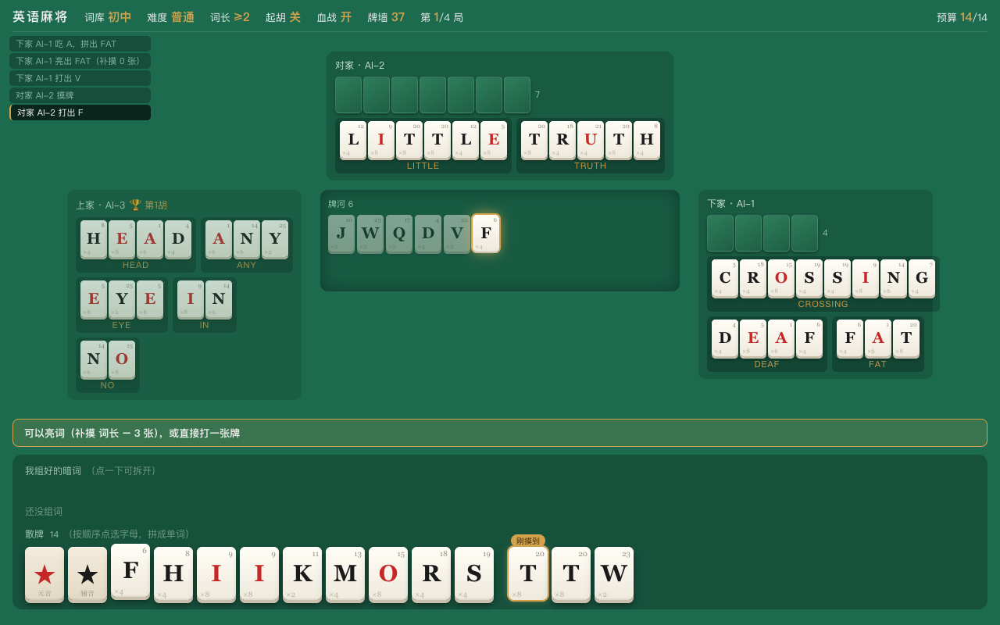
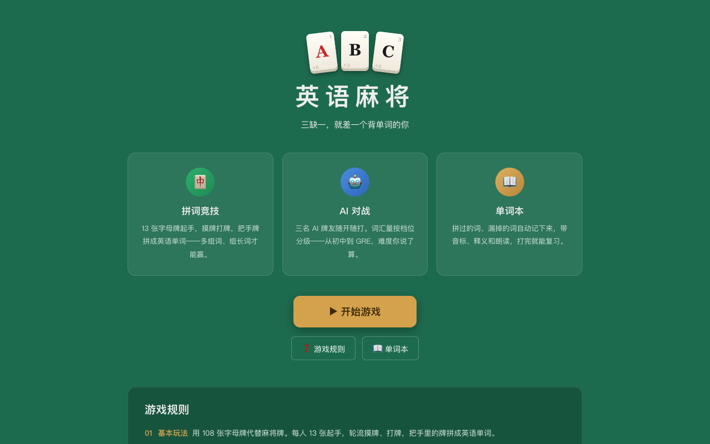

# 英语麻将 English Mahjong 🀄

> 三缺一，就差一个背单词的你。

用 **108 张字母牌**打一场麻将：摸牌、打牌、吃牌、胡牌一样不少——但你拼的不是顺子和刻子，而是**英语单词**。

**🎮 在线试玩：[englishmahjong.com](https://englishmahjong.com)** —— 免注册、免下载，点开就打。



## 灵感来源

- **成都一位校长发明的实体「英语麻将」教具**——用字母牌拼单词来打麻将，这个绝妙的点子源于教学一线；
- **《爱情公寓5》第 3 集**的英语麻将牌局，让更多人见识了这种玩法。

在它们的启发下，我重新补充完善了一整套能自洽运转的规则——亮词与暗词、14 张预算、吃牌与胡牌判定、计分体系——并把它做成了可以随时和 AI 开一局的网页版。

## 为什么值得一试

- **规则一句话讲完**：多组词、组长词。会打麻将的秒懂节奏，不会打麻将的当拼词游戏玩。
- **亮词还是扣着？** 亮词只占 3 格预算、还能补摸「词长 − 3」张，推进飞快；扣在手里当暗词难度大得多，结算 **×2**。效率流还是高分流，每一手都是抉择。
- **AI 靠词汇量取胜，不靠作弊**：三个 AI 牌友的强弱完全来自词汇量档位（初中 → 高考 → 四六级 → 考研 → 托福 → GRE）。打不过它，不是你手气差，是它单词量比你大——这个不服跑去背单词就能赢回来。
- **单词本自动帮你复盘**：拼过的词、以及那句扎心的「这堆牌你本来能拼出 FLUTE，你没看出来」——漏掉的词全部记档，带音标、释义、朗读，跨场次累积。
- **系统只当裁判，不当选手**：它绝不告诉你「你还能拼什么」，最后胡牌的那个词必须你自己拼出来。想要提示？可以开，但用提示拼的词会在单词本里留下「被提示」的印记。
- **白搭牌**：元音白搭 ×2、辅音白搭 ×2，全场最灵活的牌——但不许打出，怎么用好它是进阶功课。

## 规则速览

1. **基本玩法**：每人 13 张字母牌起手，轮流摸牌、打牌，把手牌拼成英语单词。
2. **亮词与暗词**：拼成的词可以亮出来（补摸「词长 − 3」张），也可以扣着当暗词（得分 ×2）。
3. **吃牌**：上家打出的牌可以吃，但必须当场拼成 ≥3 字母的词亮出。
4. **胡牌**：14 张预算被单词填满、零剩余即胡。血战到底：先胡的退出，其余人继续。
5. **计分**：字母越稀有分越高，得分再乘词长——BEAUTIFUL 一个词 135 分，抵一堆短词。

完整规则、计分表和 FAQ 都在游戏内的「游戏规则」页。



## 这个仓库是什么

英语麻将的**网页前端**（React 18 + TypeScript + Vite，样式为手写 CSS，无 UI 框架）。

一个刻意的架构决定：**前端零规则、零词典**。它只做三件事——渲染服务端下发的牌局状态、回放事件动画、把你的操作发回去。词典（17 万词）、规则引擎、AI、计分全部在服务端：

- **防作弊**：别人的手牌和牌墙顺序从不下发，开着 DevTools 也看不穿牌局；
- **教学立场可信**：词表根本不在浏览器里，「系统不会偷偷告诉你答案」不是承诺，是物理事实。

后端（Python）暂未开源，敬请期待。

### 本地开发

```bash
npm install
npm run dev          # Vite dev server，/api 代理到 localhost:8000
npm run build        # 含 tsc 类型检查
node playthrough.mjs # Playwright 端到端：真实浏览器打完一整局
```

没有后端时可以查看界面（首页 / 设置页 / 规则页），完整游玩请去 [线上版本](https://englishmahjong.com)。

## TODO / Roadmap

- [ ] 单词本导出
- [ ] 更多词库档位
- [ ] 真人联机对战（房间制）
- [ ] 排行榜 / 每日一局
- [ ] 胡牌需朗读单词或写出释义
- [ ] 造句玩法、限时玩法
- [ ] 移动端竖屏布局打磨、iOS/Android App

## 贡献

有想法或踩到 bug？[开个 issue](../../issues) 聊聊——UI、交互、动画、文案随便提，玩法建议尤其欢迎。

## 协议

[MIT](LICENSE)

---

**把背单词这件事，打成一圈麻将。** 🀄
